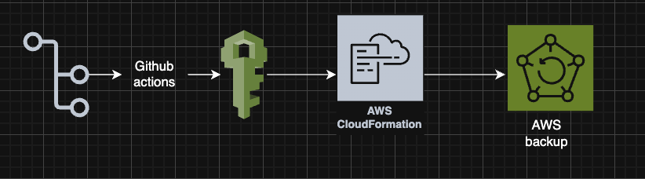
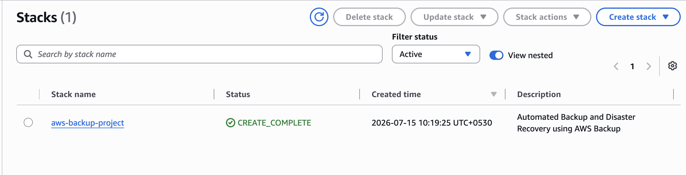

Automated Backup & Disaster Recovery using AWS Backup
Project Overview

This project demonstrates how to automate backup and disaster recovery for AWS resources using AWS Backup, CloudFormation, and GitHub Actions. The infrastructure is provisioned using Infrastructure as Code (IaC), while GitHub Actions automates deployment through a CI/CD pipeline.

The solution creates a centralized Backup Vault, Backup Plan, IAM Role, and Backup Selection to ensure that critical resources are protected against accidental deletion, corruption, or infrastructure failures.

Real-World Scenario

Organizations rely on critical AWS resources such as EC2 instances, EBS volumes, RDS databases, and EFS file systems to run production workloads.

If an engineer accidentally deletes data, a server becomes corrupted, or an infrastructure failure occurs, businesses need a reliable method to restore their workloads quickly.

Performing backups manually is time-consuming, error-prone, and difficult to manage across multiple AWS resources.

AWS Backup automates this process by centrally managing backup schedules, retention policies, and recovery points.

Problem Statement

Manual backup management introduces several operational risks:

Backups may be forgotten.
Recovery can be slow during failures.
Compliance requirements may not be met.
Data loss can lead to business downtime.
Managing backups across multiple AWS services becomes increasingly complex.

Solution

This project automates backup management by provisioning:

AWS Backup Vault
AWS Backup Plan
Backup Schedule
Backup Retention Policy
IAM Service Role
Backup Resource Selection

Deployment is fully automated using CloudFormation and GitHub Actions.

How It Works
Developer pushes code to GitHub.
GitHub Actions deploys the CloudFormation template.
CloudFormation provisions AWS Backup resources.
AWS Backup creates a Backup Vault.
A Backup Plan defines the backup schedule and retention period.
Protected resources are associated with the backup plan.
Recovery points are created automatically according to the schedule.
Verification

After deployment, verify the following:

CloudFormation

Stack Status

CREATE_COMPLETE
AWS Backup

Verify the following resources exist:

ProjectBackupVault
DailyBackupPlan
IAM

Verify the IAM Role:

AWSBackupServiceRoleProject

contains the required AWS Backup managed policies.

Backup Jobs

Navigate to:

AWS Backup

↓

Backup Jobs

Confirm that backup jobs are successfully created after running an on-demand backup or when the scheduled backup executes.

Recovery Points

Navigate to:

AWS Backup

↓

Protected Resources

Confirm that recovery points have been created successfully.

---

# Architecture Diagram

The following architecture illustrates the automated backup and disaster recovery workflow implemented in this project.

  

---

# CloudFormation Stacks

The following screenshot shows the CloudFormation stacks successfully deployed for this project.

  

